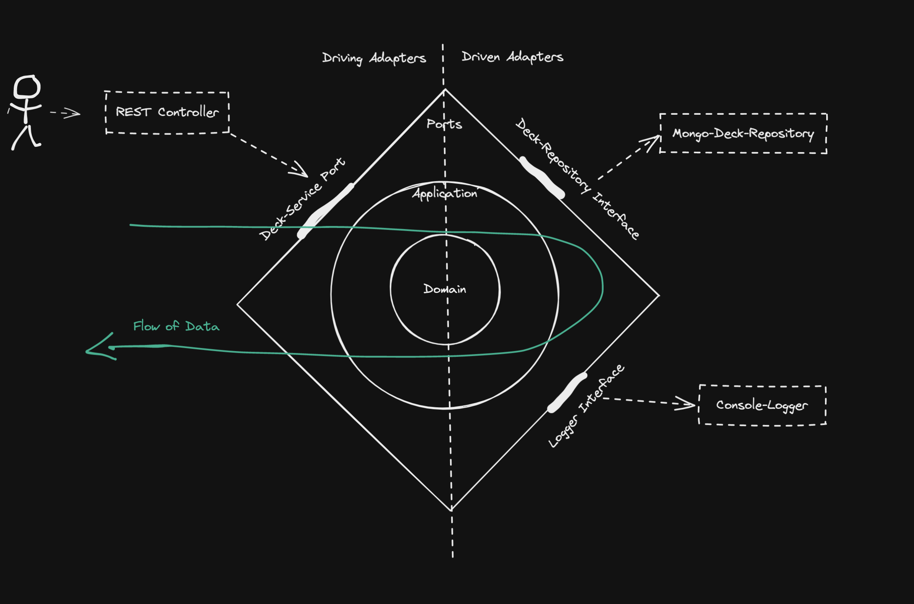

# KATANA Backend Programming Test


* [Installation and requirements](#installation-and-requirements)
* [Architecture](#architecture)


## Installation and requirements

In order to run it locally you can either use [Docker](https://www.docker.com) with [Docker Compose](https://docs.docker.com/compose/) or run it in a local NodeJS environment.

```
git clone https://github.com/BenediktGeiger/katana.git
cd katana
docker-compose up --build
```

| URL                                                                      | Information                                            |
|--------------------------------------------------------------------------|--------------------------------------------------------|
| POST http://localhost:8083/v1/decks                                      | Create A Deck                                          |
| GET http://localhost:8083/v1/decks/{deckID}                              | Open A Deck                                            |
| PATCH http://localhost:8083/v1/decks/{deckID}                            | Draw a card                                            |


### Create a Deck

```
curl --location --request POST 'http://localhost:8083/v1/decks' \
--header 'Content-Type: application/json' \
--data-raw '{
    "type": "FULL",
   "shuffled": true
}'
```

### Open a Deck

```
curl --location --request GET 'http://localhost:8083/v1/decks/{deckID}'
```

### Draw a card from deck

```
curl --location --request PATCH 'http://localhost:8083/v1/decks' \
--header 'Content-Type: application/json' \
--data-raw '{
   "deckId": "{deckId}",
   "amount": 1
}'
```


### Run Tests

```
git clone https://github.com/BenediktGeiger/katana.git
cd katana
npm install
npm run test
```


In order to run the application natively a mongo instance must be running on 127.0.0.1:27017 and the environment variables needs to be changed to 
```
DB_HOST=127.0.0.1
DB_NAME=decks
DB_PORT=27017
```


## Architecture

<h1 align="center">
  
</h1>

